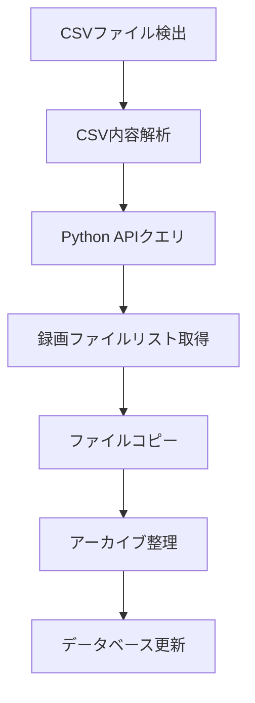

# IPカメラ録画システム ドキュメント

## システム概要

このシステムは、IPカメラのリアルタイム録画とアーカイブ管理を行う統合ソリューションです。

### システムアーキテクチャ

```
[IPカメラ] --RTSP--> [Python録画API] <--HTTP API--> [C# Recording Manager]
                            |                               |
                            v                               v
                    [録画ファイル保存]              [アーカイブ管理]
```

## プロジェクト1: Python録画APIサービス

### プロジェクト場所
```
/mnt/d/wch/recoder/
```

### ディレクトリ構造
```
recoder/
├── recorder.py           # メイン録画サービス
├── config.yaml          # 設定ファイル
├── requirements.txt     # Python依存関係
├── templates/
│   └── index.html      # Web管理インターフェース
├── static/
│   └── style.css       # スタイルシート
└── recordings/         # 録画ファイル保存ディレクトリ
    └── camera_01/
        ├── camera_01_20241203_120000_to_20241203_120100.mp4
        └── ...
```

### 主要ファイル説明

#### recorder.py
- **機能**: FFmpegを使用したRTSP録画、HTTP API提供、Web UI
- **主要クラス**:
  - `CameraRecorder`: 単一カメラの録画管理
  - `RecorderManager`: 複数カメラの統合管理
  - `RecordingFile`: 録画ファイル情報
- **エンドポイント**:
  - `POST /api/start/{camera_id}`: 録画開始
  - `POST /api/stop/{camera_id}`: 録画停止
  - `GET /api/status/{camera_id}`: ステータス確認
  - `GET /api/recordings/query`: 録画ファイル検索
  - `GET /`: Web管理画面

#### config.yaml
```yaml
cameras:
  camera_01:
    name: "正面入口"
    rtsp_url: "rtsp://192.168.1.100:554/stream"
    enabled: true

recording:
  base_path: "recordings"
  segment_duration: 60  # 秒
  retention_days: 30
  auto_cleanup: true

server:
  host: "127.0.0.1"
  port: 9999

ffmpeg:
  path: "C:\\ffmpeg\\bin\\ffmpeg.exe"
  log_level: "warning"
```

### API仕様

#### 録画開始
```http
POST http://127.0.0.1:9999/api/start/camera_01
Content-Type: application/json

{
  "rtsp_url": "rtsp://192.168.1.100:554/stream",
  "segment_duration": 60,
  "retention_days": 30
}
```

#### 録画クエリ
```http
GET http://127.0.0.1:9999/api/recordings/query?camera_id=camera_01&start_time=2024-12-03T10:00:00&end_time=2024-12-03T11:00:00
```

レスポンス例:
```json
{
  "success": true,
  "result": {
    "camera_id": "camera_01",
    "start_time": "2024-12-03T10:00:00",
    "end_time": "2024-12-03T11:00:00",
    "files": [
      {
        "path": "recordings/camera_01/camera_01_20241203_100000_to_20241203_100100.mp4",
        "filename": "camera_01_20241203_100000_to_20241203_100100.mp4",
        "size": 10485760,
        "start_time": "2024-12-03T10:00:00",
        "end_time": "2024-12-03T10:01:00",
        "duration": 60
      }
    ]
  }
}
```

### 起動方法
```bash
cd /mnt/d/wch/recoder
python recorder.py
```

### トラブルシューティング

#### ポートバインディングエラー
```
エラー: [WinError 10013] アクセス許可で禁じられた方法でソケットにアクセスしようとしました
```
**解決策**: config.yamlでポート番号を変更（例: 9999）

#### FFmpeg録画エラー
```
エラー: FFmpeg process failed
```
**解決策**:
- FFmpegパスを確認
- RTSPストリームURLを確認
- ネットワーク接続を確認

## プロジェクト2: C# Recording Manager

### プロジェクト場所
```
D:\wch\RecordingManager\
```

### ディレクトリ構造
```
RecordingManager/
├── RecordingManager.sln                  # ソリューションファイル
└── RecordingManager/
    ├── RecordingManager.csproj          # プロジェクトファイル
    ├── App.config                       # アプリケーション設定
    ├── Program.cs                       # エントリーポイント
    ├── packages.config                  # NuGetパッケージ
    │
    ├── Models/                          # データモデル
    │   ├── CsvRecord.cs                # CSV録画レコード
    │   ├── RecordingFile.cs            # 録画ファイル情報
    │   ├── RecordingInfo.cs            # 録画情報（DB用）
    │   └── MonitorConfig.cs            # 監視設定
    │
    ├── Services/                        # ビジネスロジック
    │   ├── FolderMonitorService.cs     # フォルダ監視
    │   ├── CsvReaderService.cs         # CSV読み取り
    │   ├── VideoQueryService.cs        # ビデオ検索
    │   └── FileManagementService.cs    # ファイル管理
    │
    └── Forms/                           # UIフォーム
        ├── MainForm.cs                 # メインフォーム
        ├── MainForm.Designer.cs
        ├── MainForm.resx
        ├── SettingsForm.cs            # 設定フォーム
        ├── SettingsForm.Designer.cs
        ├── SettingsForm.resx
        ├── SearchForm.cs              # 検索フォーム
        ├── SearchForm.Designer.cs
        └── SearchForm.resx
```

### 主要コンポーネント

#### FolderMonitorService
- **機能**: 指定フォルダのCSVファイル監視
- **イベント**: `CsvDetected` - CSVファイル検出時
- **設定**: カメラIDとフォルダのマッピング

#### VideoQueryService
- **機能**: 録画情報の管理とクエリ
- **メソッド**:
  - `SearchByDateRange()`: 日付範囲検索
  - `SearchByCameraId()`: カメラID検索
  - `GetStatistics()`: 統計情報取得

#### FileManagementService
- **機能**: 録画ファイルのコピーと整理
- **処理フロー**:
  1. CSVファイル検出
  2. Python APIクエリ
  3. ファイルコピー
  4. メタデータ作成

### 設定ファイル (App.config)
```xml
<?xml version="1.0" encoding="utf-8"?>
<configuration>
  <appSettings>
    <add key="ApiUrl" value="http://127.0.0.1:9999/api"/>
    <add key="TargetDirectory" value="D:\RecordingArchive"/>
    <add key="AutoStart" value="false"/>
    <add key="PollInterval" value="1000"/>
  </appSettings>
</configuration>
```

### 処理フロー



### ビルド方法
1. Visual Studio 2019/2022を開く
2. RecordingManager.slnを開く
3. NuGetパッケージを復元
4. ビルド → ソリューションのビルド

### 実行要件
- .NET Framework 4.7.2
- Windows 10/11
- Python録画APIサービスが実行中

## システム連携

### 通信フロー
```
1. C# Recording Manager: CSVファイル検出
   ↓
2. HTTP GET: /api/recordings/query
   ↓
3. Python API: 録画ファイル情報返却
   ↓
4. C# Recording Manager: ファイルコピー開始
   ↓
5. アーカイブディレクトリ構造:
   RecordingArchive/
   ├── 20241203/
   │   └── basename_001/
   │       ├── basename_001.mp4
   │       ├── 20241203_100100_basename_001.mp4
   │       └── _metadata.json
```

### データフロー例

#### CSVファイル内容
```csv
BaseName,CameraID,StartTime,EndTime
basename_001,camera_01,2024-12-03T10:00:00,2024-12-03T11:00:00
```

#### API通信
```
C# → Python: GET /api/recordings/query?camera_id=camera_01&start_time=2024-12-03T10:00:00&end_time=2024-12-03T11:00:00
Python → C#: JSON response with file list
```

#### メタデータ (_metadata.json)
```json
{
  "CsvBaseName": "basename_001",
  "CameraId": "camera_01",
  "StartTime": "2024-12-03T10:00:00",
  "EndTime": "2024-12-03T11:00:00",
  "TotalFiles": 60,
  "TotalSize": 629145600,
  "TotalDuration": 3600,
  "CreatedAt": "2024-12-03T12:00:00",
  "Files": [...]
}
```

## トラブルシューティングガイド

### Python録画API

| 問題 | 原因 | 解決策 |
|------|------|--------|
| ポートバインディングエラー | ポートが使用中 | config.yamlでポート変更 |
| FFmpeg録画失敗 | RTSPストリーム接続不可 | URL、ネットワーク確認 |
| セグメント録画が動作しない | FFmpegバージョン | プロセス再起動方式を使用 |

### C# Recording Manager

| 問題 | 原因 | 解決策 |
|------|------|--------|
| CSVファイル検出されない | 監視設定ミス | フォルダパス、権限確認 |
| API接続エラー | Python APIが停止中 | APIサービス起動確認 |
| ファイルコピー失敗 | アクセス権限不足 | 管理者権限で実行 |

## メンテナンス

### ログファイル場所
- Python API: `/mnt/d/wch/recoder/logs/`
- C# Manager: `%APPDATA%\RecordingManager\logs\`

### データベース
- 録画情報: `%APPDATA%\RecordingManager\recordings.json`
- 設定ファイル: `%APPDATA%\RecordingManager\settings.json`

### バックアップ推奨項目
1. config.yaml (Python)
2. settings.json (C#)
3. recordings.json (データベース)
4. アーカイブディレクトリ

## 技術仕様

### Python録画API
- **言語**: Python 3.8+
- **フレームワーク**: FastAPI
- **録画**: FFmpeg (stream copy)
- **非同期処理**: asyncio
- **ファイル形式**: MP4 (H.264/H.265)

### C# Recording Manager
- **言語**: C# 7.0
- **フレームワーク**: .NET Framework 4.7.2
- **UI**: Windows Forms
- **JSON**: Newtonsoft.Json
- **監視**: FileSystemWatcher

### 性能指標
- 最大同時録画数: 10カメラ
- セグメント長: 60秒
- API応答時間: < 100ms
- ファイルコピー: 100MB/秒

## サポート情報

### 更新履歴
- v1.0.0 (2024-12-03): 初期リリース
  - 基本録画機能
  - Web UI
  - C#管理アプリケーション

### 既知の問題
1. FFmpegセグメントモード非対応 → タイマー方式で対応
2. 大量ファイルコピー時のUI応答性 → 非同期処理で改善済み

### 今後の改善予定
- [ ] 録画プレビュー機能
- [ ] 詳細な統計ダッシュボード
- [ ] 録画ファイルの暗号化
- [ ] クラウドストレージ連携

## ライセンス
内部使用専用

---
作成日: 2024-12-03
最終更新: 2024-12-03